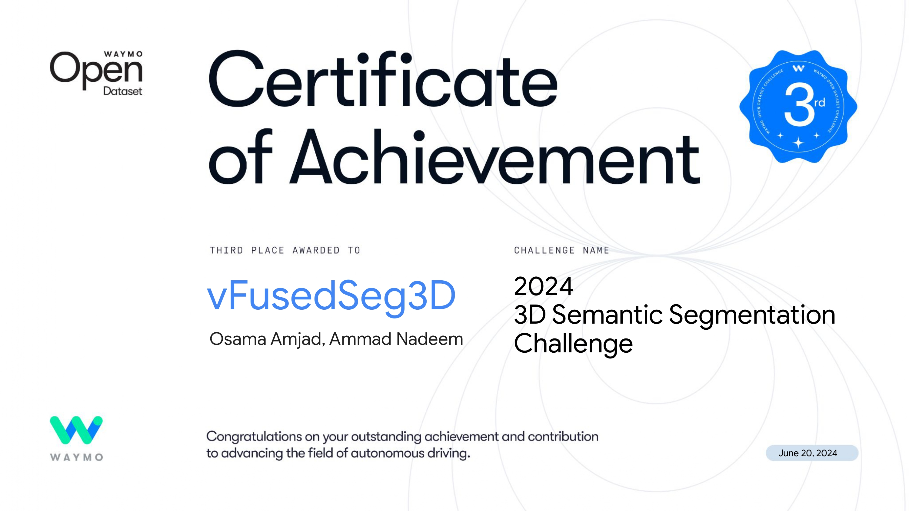
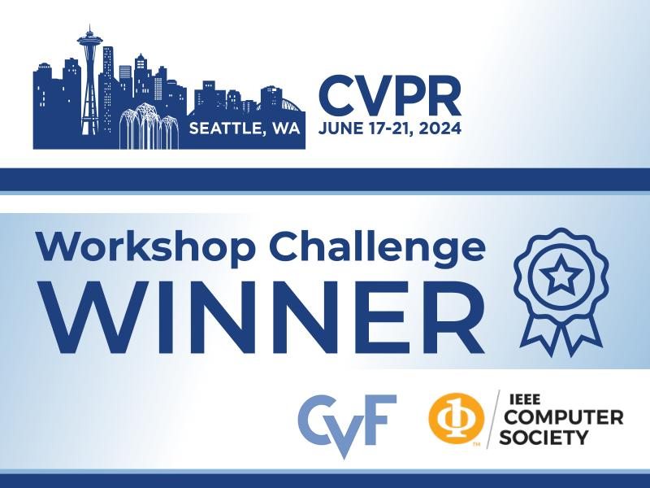
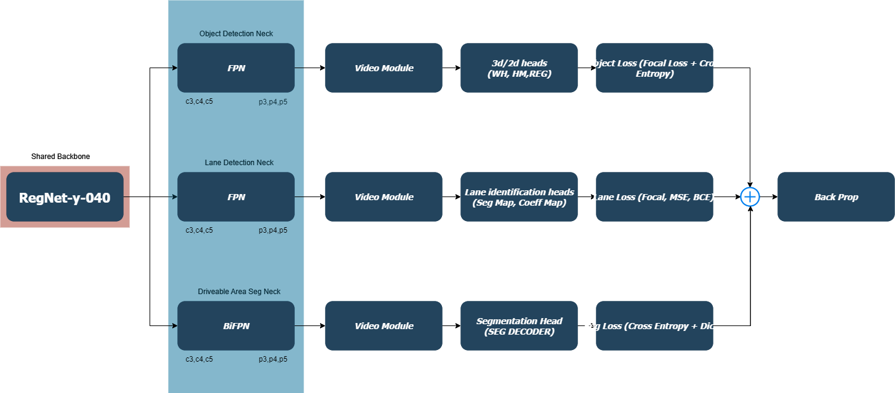
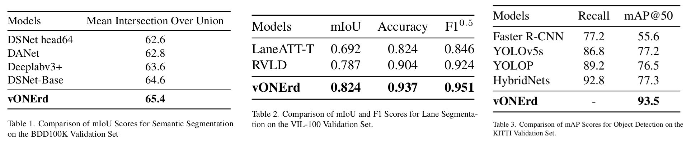
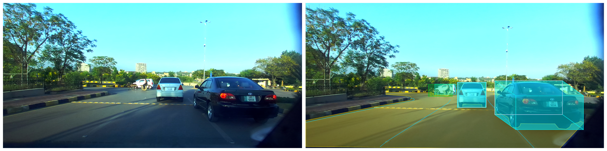

<table width="100%">
<tr>

<!-- Image Side -->
<td width="30%" align="center" >

</td>

<!-- Text Side -->
<td width="70%" align="left" valign="top">

<h1>Hi, I’m Osama 👋</h1>

<h3>Head of AI & R&D @ <strong>VisionRD</strong> | Computer Vision Specialist</h3>

 

📠Islamabad, Pakistan

📞 +92 332 4465702 &nbsp;|&nbsp;
✉️ <a href="mailto:osamamjad26@gmail.com">osamamjad26@gmail.com</a> &nbsp;|&nbsp;
🔗 <a href="https://www.linkedin.com/in/osamaamjad" target="_blank">LinkedIn Profile</a>

</td>

</tr>
</table>

## 🚀 About Me

I'm an AI innovator passionate about building **real-world solutions for the OEM (Original Equipment Manufacturers) industry**.  
At VisionRD, I've contributed to projects that redefined the technology landscape for major automotive brands like **Toyota**, **Haval**, **Changan**, and **Thal Engineering**.

Focus Areas
-  **Advanced AI/ML Research**, Model Development, and Deployment
-  **Autonomous Systems Engineering** tailored to real-world challenges
-  **Leadership and Mentoring** teams toward impactful results

> *"I thrive at the intersection of **innovation** and **execution**, pushing boundaries to create tangible impact."*

---

## 🎓 Education

- **National University of Science and Technology (NUST)**  
  *MS Electrical Engineering, Artificial Intelligence and Autonomous Systems*  
  *Sept 2021 – May 2025* | GPA: 3.5/4.0

- **Bahria University Islamabad**  
  *BS Electrical Engineering*  
  *Sept 2017 – May 2021* | GPA: 3.4/4.0

---

## 💼 Experience

### Head of AI and R&D — VisionRD  
*Aug 2024 – Present* | Islamabad, Pakistan

- Led **vFusedSeg3D**, achieving **3rd place at Waymo Open Dataset Challenge 2024**; technical paper accepted at **CVPR 2024**.
- Deployed **vFusedAct** real-time video action recognition at **Thal Engineering, HAVAL Pakistan, and KIA Lucky Motors**.
- Built **InspectionAI** system for **RapidEV**, inspecting **10-15M PCB units annually**.
- Created **vRD-OCR**, winning "Most Innovative Project" at **Ready Tensor Expo 2024**, deployed at **Toyota Pakistan**.
- Introduced **vONErd** inspired by Tesla's unified networks achieving:
  - 3D/2D Object Detection: **93% mAP**
  - Lane Detection: **95.8% F1 Score**
- Achieved **55ms real-time latency**, surpassing global ADAS benchmarks by 9%.
- Launched **PDrive20K**, Pakistan’s largest autonomous driving dataset.

  
  

---

### Senior Computer Vision Engineer / Team Lead — VisionRD  
*May 2023 – Aug 2024* | Islamabad, Pakistan

- Contributed to **vONErd** and **vFusedSeg3D** model pipelines.
- Focused on real-time inference and scalability using **TensorRT** and **CUDA** optimizations.

  
  &nbsp;&nbsp;&nbsp;

  
  &nbsp;&nbsp;&nbsp;

  
  &nbsp;&nbsp;&nbsp;

---

### Computer Vision Engineer — VisionRD  
*Jul 2022 – May 2023* | Islamabad, Pakistan

- Built **ADAS modules**: Front Collision Alert, Pedestrian Cross Alert, and 360° Monitoring.
- Designed models for **Pakistani Road Sign Detection**.
- Developed integrated models for 3D/2D detection, segmentation, and lane detection achieving **50+ FPS**.
- Applied uncertainty estimation techniques for scenario extraction in autonomous driving.
- Deployed solutions on **AWS SageMaker**, **EC2**, and **S3**.
- Supported by organizations like **World Bank**, **HEC Pakistan**, and **Startup Germany (AHK)**.

---

## 📚 Publications

- **vFusedSeg3D: 3rd Place Solution for Waymo Open Dataset Challenge 2024**  
  *(Osama Amjad, Ammad Nadeem — CVPR 2024)*  
  [Paper on Arxiv](https://arxiv.org/abs/2408.15254)

- **vRD-OCR: Multi-Head Long Text Recognition in Low Quality Images**  
  *(Osama Amjad, Khadija Irfan, Amur Pal — Ready Tensor)*  
  [Read Here](https://app.readytensor.ai/publications/vrdocr-multihead-long-text-recognition-in-low-quality-images-s3TebOv2I3iT)

---

## 🛠️ Technologies & Skills

- Python, PyTorch
- Deep Neural Network (DNN) Architecture Building
- CUDA Programming
- TensorRT, ONNX
- GenAI, Stable Diffusion
- Online Real-time Inference

---

## 📈 Let's Connect!

I'm always open to collaborations, innovative projects, and knowledge-sharing opportunities! Feel free to connect! 🚀
